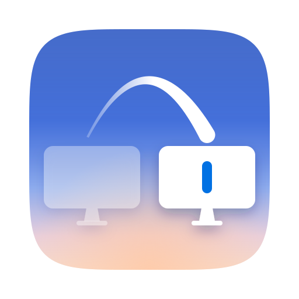

<p align="center"></p>

# GazeHop

Look at a screen, and your keyboard follows.

**Website:** https://gazehop.gazehop-site.workers.dev

GazeHop is a tiny macOS menu-bar app for multi-monitor setups: 2, 3, 4 or more screens. It uses your webcam to see
which screen you're looking at and moves keyboard focus to the last window you used on that
screen — so you stop typing into the window you just left.

Everything runs on your Mac. No video is recorded, stored, or sent anywhere.

## How it works

- **Tracking:** Apple's Vision framework reads head direction (yaw, nose position) and eye
  gaze (pupil position within each eye) from the front camera.
- **One person:** GazeHop locks onto one face (you, at the desk) and ignores anyone else in view.
- **Deciding:** a quick calibration (look at a dot on each screen) trains a nearest-centroid
  model. GazeHop switches only after you've looked at a screen for 250 ms, with a 0.6 s
  cooldown, and never while you're dragging.
- **Switching:** the Accessibility API brings back the last window you used on that display
  (or the frontmost window there, so no setup clicks are needed), raises it, and (optionally) moves the pointer there so scrolling works too.

## Install (no coding needed)

1. Download **GazeHop-x.y.zip** from the [latest release](https://github.com/kabirshah4/GazeHop/releases/latest)
   and double-click it to unzip.
2. Drag **GazeHop.app** into your **Applications** folder.
3. Open it. macOS will say it *can't verify* the app, because GazeHop isn't notarized by
   Apple (that needs a paid developer account). To open it anyway:
   - Click **Done** (not *Move to Trash*).
   - Open **System Settings › Privacy & Security**, scroll down, and click **Open Anyway** next
     to the GazeHop message. Confirm with your password.
4. Allow **Camera** when asked, then turn on GazeHop in **System Settings › Privacy & Security ›
   Accessibility**.
5. Follow the calibration dots on each screen. Done: the GazeHop icon in the menu bar (two
   screens with an arc) means it's on.

## Known limitations

- **Early version.** Tested on one Mac (Apple Silicon, macOS 27) with two side-by-side displays
  and a built-in webcam. 3+ screens, external webcams, and Intel Macs should work but haven't
  been tested much.
- **Screen layout matters.** Screens at clearly different angles from you work best. Two screens
  almost directly in line are hard to tell apart.
- **Recalibrate when things move**: your chair, the camera, or the screens.
- **Lighting and glasses.** Dim rooms, strong backlight, or reflective glasses make eye tracking
  noisier; head direction still works.
- **Not notarized**, so macOS shows a warning the first time (see Install).
- **Full-screen games** lose focus if you glance at another screen; press **⌘F1** to pause.

Found a problem? [Open an issue](https://github.com/kabirshah4/GazeHop/issues) with your Mac,
macOS version, number of screens, and webcam.

## Build from source

### Requirements

- macOS 14 or later, two or more displays (any number; Sidecar iPads count too), a webcam
- Xcode command-line tools (Swift 5.9+) to build

### Build and run

```sh
./scripts/make-signing-cert.sh   # once: lets macOS remember permissions across rebuilds
./build.sh
open build/GazeHop.app
```

On first launch:

1. Allow **Camera** access.
2. Enable GazeHop in **System Settings › Privacy & Security › Accessibility**.
3. Follow the calibration dots on each screen.

GazeHop shows up in the menu bar (next to the battery and clock) as two small screens with an arc. You can add
the name next to it in **Settings › General**.

> **Why the signing script?** macOS ties Camera and Accessibility permission to an app's code
> signature. Without a certificate, each build is signed ad-hoc and looks like a brand-new app,
> so you'd have to allow everything again after every rebuild. `make-signing-cert.sh` creates a
> self-signed certificate ("GazeHop Local Signing") in your login keychain; `build.sh` uses it
> automatically. It never leaves your Mac.

## Using it

| Menu | |
|---|---|
| **Pause / Resume (⌘F1)** | Pause from anywhere, e.g. while gaming. On Mac keyboards you may need **Fn⌘F1**. |
| **Calibrate…** | Re-run calibration (needed if you move your screens or camera, or add a new screen) |
| **Screens** | Check/uncheck each connected display. Unchecked screens are never switched to |
| **Settings… (⌘,)** | Everything below |

The menu bar icon shows the state: plain = on, slashed = paused, dot = needs attention
(calibration or permission).

### Settings

| Tab | Options |
|---|---|
| **General** | Launch at login · show the name in the menu bar · move pointer with focus · sounds · pause shortcut (⌘F1, ⌥F1, ⌃⌥G, ⌃⌥⌘G or none) |
| **Tracking** | Look time before switching · minimum time between switches · strictness · smoothing · recalibrate |
| **Screens** | Per-display on/off, calibration status |
| **Advanced** | Debug logging, open log, shortcuts to Camera/Accessibility settings |

All settings apply immediately.

## Multiple screens

GazeHop calibrates every connected display and picks whichever one you're looking at.

- **Unplugging a screen** doesn't need recalibration; GazeHop just ignores it until it's back.
- **Plugging in a new screen** shows *New screen connected: calibrate* in the menu; run
  **Calibrate…** to include it.
- Accuracy depends on how far apart the screens are from your point of view: side-by-side
  and stacked layouts work best; two screens at almost the same angle are hard to tell apart.

## Tests

```sh
swift test
```

## Icons

The logo lives in `site/brand/logo-mark.svg`. To regenerate the app icon, README logo and
website favicons from it:

```sh
cd site && npm install && node scripts/make-app-icon.mjs
```

The menu bar icon is drawn in code (`Sources/GazeHop/MenuBarIcon.swift`).

## Debugging

Turn on **Settings › Advanced › Detailed debug logging**, then:

```sh
tail -f ~/Library/Logs/GazeHop.log
```

Switch attempts are always logged.

## Safety

- GazeHop never moves focus while a password field is active (macOS secure input).
- By default it waits for a short pause in your typing, so a glance can't split a word across windows.
- Press **⌘F1** to pause it anytime.

## Privacy

GazeHop has no accounts, servers, analytics, or crash reporting.

- **Camera:** frames are analysed in memory on your Mac to find head direction and eye position,
  then discarded. Nothing is saved, recorded, or uploaded.
- **No network:** GazeHop makes no network connections at all.
- **Stored on your Mac only:** your settings and calibration (a few numbers per screen, not
  images), in GazeHop's preferences.
- **Log:** `~/Library/Logs/GazeHop.log` (capped at ~1 MB) records switch events with app names. Window
  titles are only logged if you turn on detailed debug logging. It never leaves your Mac; delete it anytime.
- **Calibration:** a few averaged head and eye angles per screen, no images. Delete it in
  Settings › Advanced.

The code is open, so you can check all of this yourself.

## Website

The landing page lives in [`site/`](site) (Vite + React + Tailwind) and is deployed to
Cloudflare Workers static assets:

```sh
cd site
npm install
npm run dev        # local preview
npm run deploy     # build + wrangler deploy
```

## License

GazeHop's own code is MIT licensed. Some website components have their own licenses; see
[THIRD_PARTY_NOTICES.md](THIRD_PARTY_NOTICES.md).

MIT
